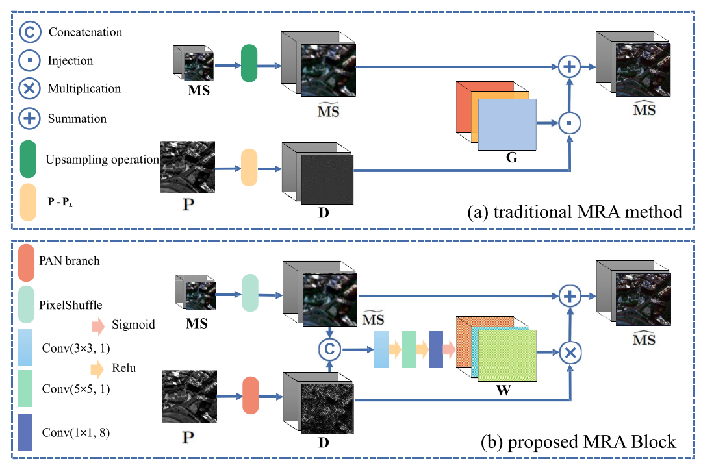
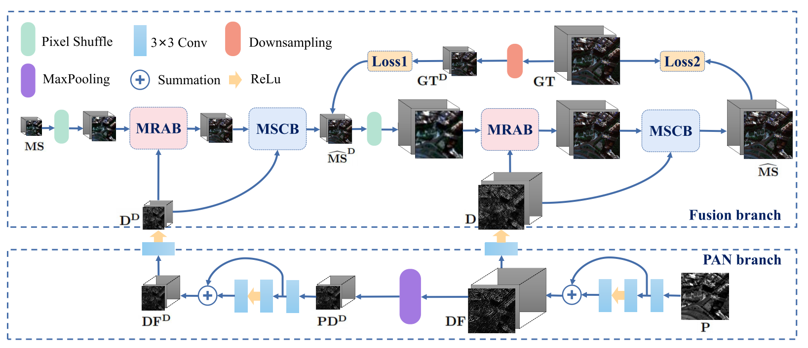
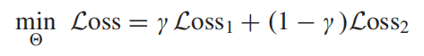
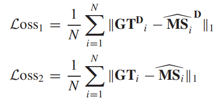
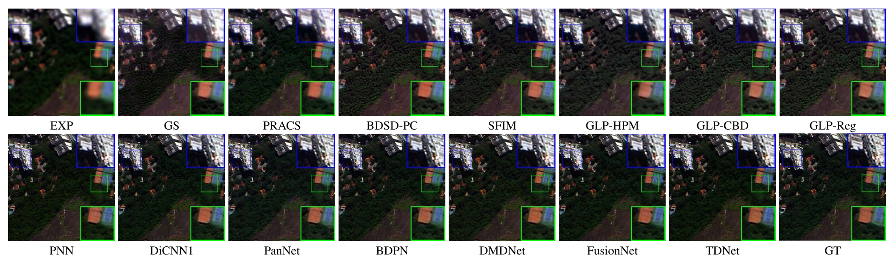
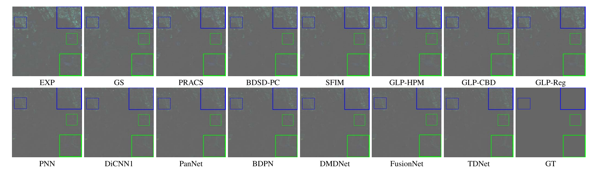
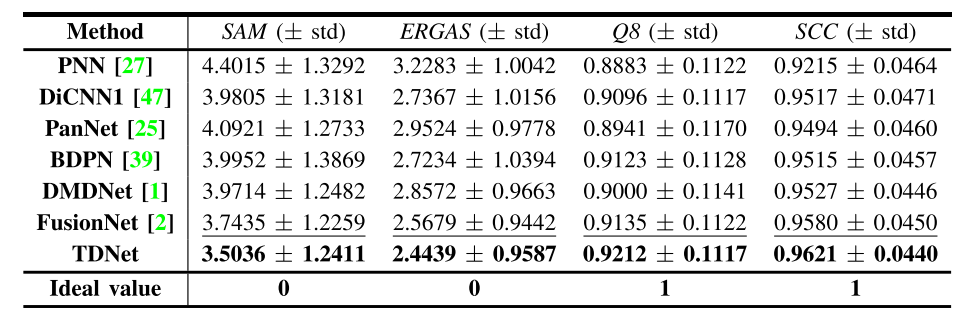

# A Triple-Double Convolutional Neural Network for Panchromatic Sharpening.

Homepage: 

https://liangjiandeng.github.io/

- Code for paper: " A Triple-Double Convolutional Neural Network for Panchromatic Sharpening"
- State-of-the-art pansharpening performance


# Dependencies and Installation
- Python 3.8 (Recommend to use [Anaconda](https://www.anaconda.com/))
- Pytorch 1.7.0
- NVIDIA GPU + CUDA
- Python packages: `pip install numpy scipy h5py`
- TensorBoard


# Dataset Preparation
The datasets used in this paper is WorldView-3 (can be downloaded [here](https://www.maxar.com/product-samples/)), QuickBird (can be downloaded [here](https://earth.esa.int/eogateway/catalog/quickbird-full-archive)) and GaoFen-2 (can be downloaded [here](http://www.rscloudmart.com/dataProduct/sample)). Due to the copyright of dataset, we can not upload the datasets, you may download the data and simulate them according to the paper.


# Get Started
Training and testing codes are in '[codes/](./codes)'. 

-   The code for training is in train.py, while the code for test on one image (.mat) is in main_test_single.py and we also provide our pretrained model "pretrained.pth".
    
-   For training, you need to set the file_path in the main function, adopt to your train set, validate set, and test set as well. Our code train the .h5 file, you may change it through changing the code in main function.
    
-   As for testing, you need to set the path in both main and test function to open and load the file.


# Method

***Motivation:*** Existing CNN-based techniques do not fully explore and utilize the multi-scale information in the PAN and MS images losing some possible information in the process of enhancing the LRMS image. This inspires us to focus on the information injection in hierarchical and bidirectional ways, which is the original intention of the triple-double structure.


***Proposed MRA block:*** (a) Diagram of traditional MRA methods. (b) MRAB was designed based on traditional MRA methods. Note that the upsampling operation in
(a) is a polynomial kernel with 23 coeffificients. 8-bands datasets are considered to defifine the number of convolution kernels in (b).




***Overall Framework:*** Flowchart of the proposed TDNet consisting in two branches, i.e., PAN branch and fusion branch. 



***Loss Fuction:*** We propose a novel deep neural network architecture with level-domain-based loss function for pansharpening by taking into account the following double-type structures:

Specififically, Loss1 and Loss2 are defifined as follows:



***Visual Results:*** Visual comparisons of all the compared approaches on the reduced resolution Rio dataset (sensor: WorldView-3).





***Quantitative Results:*** The following quantitative results is generated from WorldView-3 datasets with 1258 examples. 




# Citation
```bib
@article{TDNet,
author = {Tian-Jing Zhang, Liang-Jian Deng, Ting-Zhu Huang, Jocelyn Chanussot, and Gemine Vivone},
title = {A Triple-Double Convolutional Neural Network for Panchromatic Sharpening},
journal = {IEEE Transactions on Neural Networks and Learning Systems},
volume = {},
pages = {2162-237X},
year = {2022},
issn = {1566-2535},
doi = {10.1109/TNNLS.2022.3155655}
}
```

# Contact
We are glad to hear from you. If you have any questions, please feel free to contact [zhangtianjinguestc@163.com](mailto:zhangtianjinguestc@163.com) .


