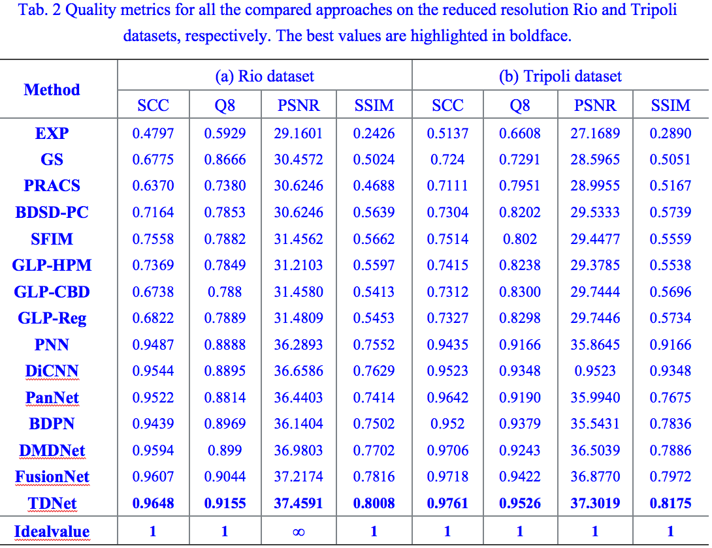

 **A TRIPLE-DOUBLE CONVOLUTIONAL NEURAL NETWORK FOR PANCHROMATIC SHARPENING**

**Homepage:** https://liangjiandeng.github.io/

[[Paper]](https://arxiv.org/abs/2112.02237)

- Code for paper: "A TRIPLE-DOUBLE CONVOLUTIONAL NEURAL NETWORK FOR PANCHROMATIC SHARPENING"

- The proposed network is trained on Pytorch 1.8.0. Because we use GPU CUDA for training by default, the modules about CUDA in the code may need to be adjusted according to your computer.

- The code for training is in train.py, while the code for test on one image (.mat) is in main_test_single.py and we also provide our pretrained model "pretrained.pth".

- For training, you need to set the file_path in the main function, adopt to your train set, validate set, and test set as well. Our code train the .h5 file, you may change it through changing the code in main function.

- As for testing, you need to set the path in both main and test function to open and load the file.

- Datasets: you may find source training and testing code from the folder. However, due to the copyright of dataset, we can not upload the datasets, you may download the data and simulate them according to the paper.

### Quantity results

**Test on the simulated images from WV3 on 1258 examples

**Test on two reduced Rio and Tripoli datasets from WV3

